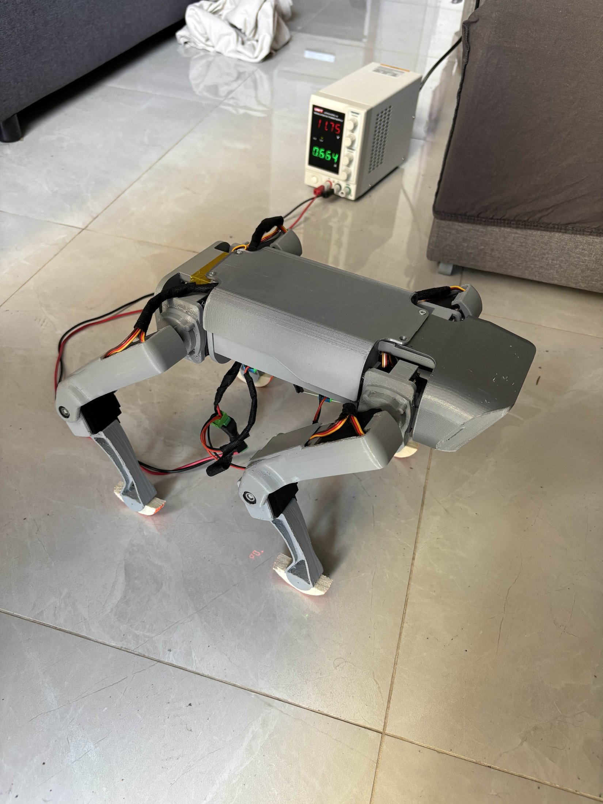
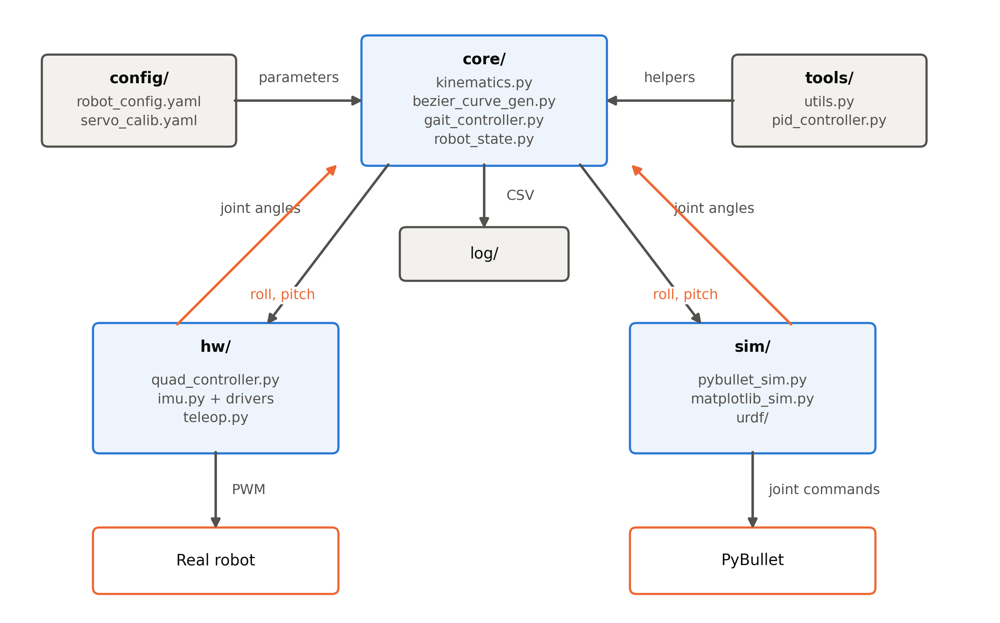
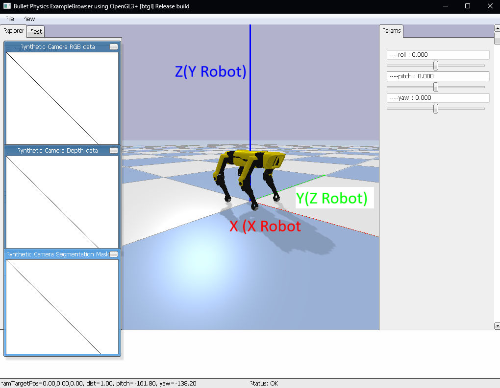
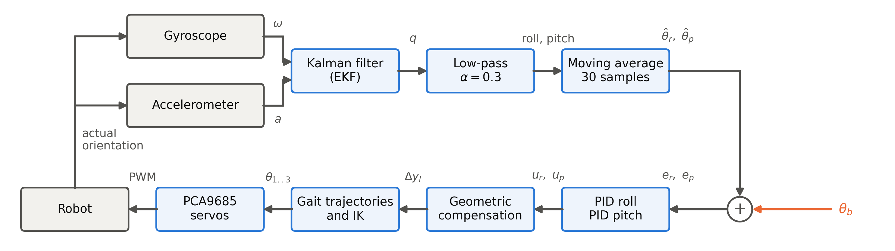

# Quadruped Robot — Design, Implementation and Motion Control

Low-cost 3D-printed quadruped robot with omnidirectional trot gait and IMU-based
attitude stabilisation. Diploma thesis, Department of Electrical and Computer
Engineering, University of Patras.

Built on the open-source [SpotMicro](https://www.thingiverse.com/thing:3445283)
design by Deok-yeon Kim (CC-BY), using the
[SpotMicro v2](https://www.thingiverse.com/thing:4155673) remix by nahueltaibo.



## Demos

Videos of the robot walking in every direction, turning in place and while
moving, and the startup transition, both on the real robot and in
simulation:

**[youtube.com/playlist?list=PLZkTyBWS-kqA](https://youtube.com/playlist?list=PLZkTyBWS-kqA&si=OrUQILE2mhKAoyir)**


---

## What it does

- **Omnidirectional gait** — commanded by linear velocity, angular velocity
  and heading, composed into a per-leg step vector; additional parameters are
  available to tune stability
- **Closed-loop attitude stabilisation** — roll/pitch PID acting on fused IMU
  data, applied as per-leg foot-height offsets
- **Five gait patterns** — trot, walk, bound, pace, pronk (phase distribution
  is parametric); only trot is fully tuned
- **Simulation environment** — a PyBullet model for testing the real
  locomotion code before it runs on hardware. Currently uses the SpotMicro v1
  URDF, since no v2 model exists yet (see [Known limitations](#known-limitations))
- **Real-time teleoperation** via a DualSense controller
- **CSV logging** of filtered IMU and PID output each run, with a PNG plot
  saved automatically — handy for headless operation over SSH

---

## Hardware

| Component     | Part                                                                                                      |
| ------------- | --------------------------------------------------------------------------------------------------------- |
| Compute       | Raspberry Pi 5 (5 V / 5 A USB-C)                                                                          |
| Servos        | 10× Feetech FT5116M, 2× Feetech FB5118M (front shoulders)                                               |
| Servo drivers | 2× PCA9685 (front`0x40`, rear `0x41`)                                                                |
| Power         | 2× XL4015 step-down (one per driver board); lab supply, or a Gens ace 1100 mAh 11.1 V 3S 60C LiPo (XT60) |
| IMU           | GY-85 (ADXL345 accel + ITG-3200 gyro + QMC5883L mag)                                                      |
| Frame         | 3D-printed PLA body, legs and servo mounts                                                                |
| Feet          | Rubber balls cut into hemispheres                                                                         |

The magnetometer is present but disabled — too noisy without shielding. Yaw
therefore has no absolute reference: it is integrated from the gyroscope
alone, so it drifts from an arbitrary startup heading. Only roll and pitch
are actively stabilised.

Physical dimensions live in [`config/robot_config.yaml`](config/robot_config.yaml),
measured on the real robot.

---

## Repository layout

```
config/     robot_config.yaml (dimensions, joint limits, gait parameters), servo_calib.yaml (real life servo zeros and directions)
core/       kinematics.py, robot_state.py, gait_controller.py, bezier_curve_gen.py
hw/         quad_controller.py, imu.py, sensor drivers, teleop.py
sim/        pybullet_sim.py, matplotlib_sim.py, urdf/ (+ STL meshes)
tools/      pid_controller.py, utils.py
log/        CSV/PNG logs + plotting scripts
thesis/     thesis pdf
```



The `core/` package is shared between the real robot and the simulation; only
the module that applies joint angles and the source of the orientation
measurement differ.

`kinematics.py` reads `config/robot_config.yaml` by relative path, so **run every
script from the repository root**.

## Entry points

| Command                          | What it does                         |
| -------------------------------- | ------------------------------------ |
| `python -m sim.pybullet_sim`   | PyBullet simulation, keyboard-driven |
| `python -m hw.quad_controller` | Hardware controller (on the Pi)      |
| `python -m hw.teleop`          | DualSense input test                 |
| `python -m sim.matplotlib_sim` | Static kinematics visualiser         |

---

## Setup

### Simulation (any machine). Tested on Python 3.9

```bash
python -m venv .venv
source .venv/bin/activate          # Windows: .venv\Scripts\activate
pip install -r requirements_sim.txt
python -m sim.pybullet_sim
```



### Hardware (Raspberry Pi). Tested on Python 3.12

```bash
pip install -r requirements.txt
sudo raspi-config      # enable I2C
i2cdetect -y 1         # expect 0x40 and 0x41 (PCA9685) plus the IMU addresses
```

For the DualSense controller, set it up following
[pydualsense&#39;s guide](https://flok.github.io/pydualsense/usage.html), then
pair it over Bluetooth:

```bash
sudo bluetoothctl
scan on
# note the controller's MAC address, then:
pair    <MAC>
trust   <MAC>
connect <MAC>
```

If the controller was already paired to another device, run `remove <MAC>`
first, then disconnect and repeat the steps above.

---

## How the gait controller works

`GaitController` exposes four `execute_gait_*` entry points that share one core
(`_compute_ramp` → `_imu_correction` → `_step_legs`) and differ only in how the
swing/stance durations and the phase clock are derived. `execute_gait_fixed_stance`
is the most robust and tuned for the real robot.
One control step:

1. **Velocity ramp** — cosine ramp over 0.5 s on both linear and angular velocity
2. **Banked-roll feedforward** — `banked_roll = sign(ω)·atan2(v², g·R)` with
   `R = |v|/|ω|`, added to the measured roll before the PID
3. **Attitude PID** — separate roll and pitch controllers with integral clamping
4. **Foot-height offset** — per leg, `dy = ±(W/2)·tan(roll) ± (L/4)·tan(pitch)`
5. **Turning composition** — per-leg yaw arc from the nominal foot position;
   linear and angular step vectors are summed, and the result drives both phases
6. **Stance** — sinusoidal dip with penetration depth δ
7. **Swing** — 16-point Bézier with stacked endpoints, giving zero foot velocity
   at lift-off and touchdown, plus an S/6 touchdown offset
8. **Inverse kinematics** per leg, after the body transform
9. **CSV logging** of filtered IMU and PID output

IMU filtering happens in the driver (`hw/imu.py`), not in the gait controller:
Madgwick (or EKF) fusion → exponential low-pass (α = 0.3) → 30-tap moving
average. The moving average removes the ~2 Hz oscillation inherent to trotting,
which would otherwise be fed straight into the PID.



---

## Coordinate frames

Three frames disagree, which is the most common source of confusion:

|                   | Mapping                          |
| ----------------- | -------------------------------- |
| PyBullet → robot | `X→X`, `Y→Z`, `Z→Y`     |
| Robot → IMU      | `X→−Y`, `Y→X`, `Z→−Z` |

The kinematics frame is **X forward, Y up, Z left**, in millimetres.

---

## Known limitations

- Only the trot gait is tuned; the other four are implemented but not
  validated.
- No joint position feedback, servos are open-loop, so there is no way to
  detect a stall or slippage.
- 10 of the 12 servos use copper (not steel) gears and wear faster under load.
- PLA is not a very durable material for load-bearing joints.
- Joints accumulate mechanical play over repeated runs, which can loosen the
  connections.
- The LiPo battery was never used in the end, its capacity was too low for
  meaningful runtime, and the current baseplate has no room for a larger
  one. All testing was done with a lab power supply.

---

## Acknowledgements

- Deok-yeon Kim — original SpotMicro design
- nahueltaibo — SpotMicro v2 remix
- The [SpotMicroAI](https://spotmicroai.readthedocs.io) community
- [spot_mini_mini](https://github.com/moribots/spot_mini_mini) — Bézier gait
  reference
- Previous student implementation at the same department
  ([QuadrupedRobotProject](https://github.com/VagTsiats/QuadrupedRobotProject-ecedk703))
- D. J. Hyun, S. Seok, J. Lee and S. Kim, "High speed trot-running:
  Implementation of a hierarchical controller using proprioceptive impedance
  control on the MIT Cheetah," *IJRR*, 2014, and G. Bledt et al., "MIT
  Cheetah 3: Design and Control of a Robust, Dynamic Quadruped Robot,"
  *IROS*, 2018 — swing/stance trajectory design
- J. H. Lee and J. H. Park, "Turning Control for Quadruped Robots in
  Trotting on Irregular Terrain," 2014, and W. Liu, L. Zhou, H. Qian and Y.
  Xu, "Turning strategy analysis based on trot gait of a quadruped robot,"
  *ROBIO*, 2017 — turning geometry
- K. Mori et al., "A Study of Trot Gait Control System of a Quadruped Robot
  Using IMU Sensor," *SICE*, 2022, and R. C. Prayogo, A. Triwiyatno and
  Sumardi, "Quadruped Robot with Stabilization Algorithm on Uneven Floor
  using 6 DOF IMU based Inverse Kinematic," *ICITACEE*, 2018 — PID
  stabilisation as a per-leg geometric foot offset
- All of the sources used are in the thesis bibliography

Supervisor: Prof. Charalampos Bechlioulis, University of Patras.

---

## Future Work

- LiDAR and camera integration for terrain sensing
- A more durable print material than the current PLA
- Redesigned shoulder joints with double-shear support
- TPU-printed feet
- A microcontroller with analog input to read servo
  position feedback
- A custom PCB to consolidate the electronics
